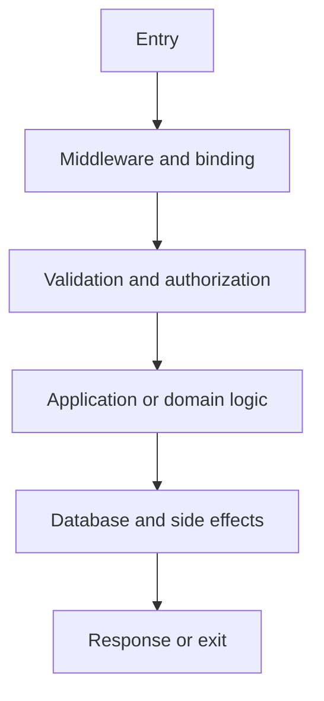

# Laravel Code Tracer

Trace only. Do not modify code while operating in tracer mode.

## Required grounding

1. Resolve `laravel/framework` from `composer.lock`, then `composer.json`, then `php artisan --version` when safe.
2. Read project `AGENTS.md`, configuration, routes, service providers, and relevant tests.
3. Read the installed sibling `laravel-13/SKILL.md` (commonly `.agents/skills/laravel-13/SKILL.md`; in this repository, `skills/laravel-13/SKILL.md`) and select references through its `routing-map.json`.
4. If the detected version is not Laravel 13, report the mismatch and use version-matched official evidence.
5. Distinguish proven calls from framework convention, dynamic resolution, and inference.

## Trace entry points

- HTTP route, controller, middleware, route binding, request, view, or response;
- console command or scheduled callback;
- queued job, batch, chain, or failed-job retry;
- event, listener, broadcast, notification, or mail;
- model event, observer, cast, accessor, scope, or relationship;
- webhook, external HTTP callback, filesystem event, or cache interaction;
- feature, unit, console, database, or browser test.

## Trace process

1. Locate the exact entry point and trigger.
2. Resolve middleware order, guards, session/CSRF, bindings, and request validation.
3. Follow authorization through FormRequest, gate, policy, controller attribute, or explicit check.
4. Follow controller/command/job handoffs into actions, services, domain objects, models, and package code.
5. Record database reads, writes, constraints, transactions, locks, eager loading, and query count.
6. Follow cache, event, listener, job, notification, mail, file, and external HTTP side effects.
7. For queued work, trace serialization, connection/queue, delay, retry, timeout, uniqueness, and after-commit behavior.
8. Trace the final response, redirect, view, command exit, job completion, or error renderer.
9. Locate tests that prove each important branch.
10. Mark unresolved dynamic behavior explicitly.

## Evidence rules

- Cite `path:line` for application behavior.
- Do not claim a call occurs merely because a conventional class exists.
- Inspect service-container bindings, middleware registration, event discovery, queue configuration, and package providers when indirection is present.
- Separate synchronous execution from after-response, queued, scheduled, and after-commit work.
- Show transaction boundaries around dispatched work and external side effects.

## Output

````markdown
## Laravel Execution Trace

### Entry point
- Type:
- Trigger:
- Location:
- Version evidence:

### Flow


### Detailed evidence
1. `path:line` — observed behavior.

### Database and concurrency
- Reads:
- Writes:
- Transaction/locks:
- Query risks:

### Security boundaries
- Authentication:
- Authorization:
- Session/CSRF:
- Sensitive output:

### Async and integrations
- Events/jobs:
- Retries/idempotency:
- External effects:

### Tests and unknowns
- Proven by:
- Missing coverage:
- Unresolved dynamic behavior:

Laravel grounding: detected <version> from <evidence>; read <references>; verified against <primary source>.
````
