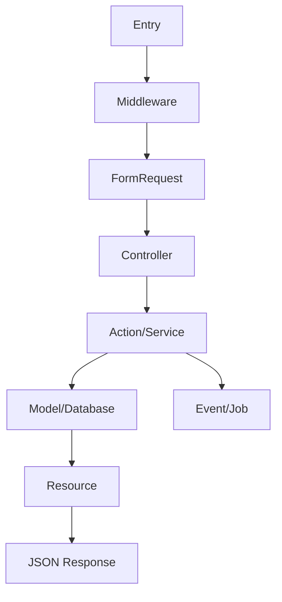

# Laravel Code Tracer

This is the Codex skill version of `agents/laravel-code-tracer`.

Use this skill when you need to trace Laravel execution flow before changing or reviewing behavior.

## Source of Truth

Before tracing Laravel API behavior, read:

1. Project root `AGENTS.md`.
2. `skills/laravel-api-design/SKILL.md`.
3. Relevant `skills/laravel-api-design/references/*.md` files.
4. Existing code patterns in the repository.
5. Context7 Laravel 13 docs when framework behavior is unclear.

## Trace These Paths

- HTTP API route
- controller method
- FormRequest validation and authorization
- middleware stack
- route model binding
- policy or gate checks
- service/action/domain calls
- Eloquent queries and writes
- transactions
- events and listeners
- queued jobs
- notifications
- external integrations
- webhook handling
- response Resource or error rendering
- tests that cover the path

## Process

1. Identify the entry point.
2. Follow middleware, guards, and bindings.
3. Follow FormRequest validation and authorization.
4. Follow controller handoff.
5. Follow services/actions/domain/model calls.
6. Identify database reads, writes, transactions, and N+1 risks.
7. Identify side effects such as jobs, events, notifications, external calls, files, cache, and webhooks.
8. Trace the final response or exit point.
9. Report missing tests or unclear behavior.

## Output Format

```markdown
## Laravel Code Execution Flow Trace

### Entry Point
- Type:
- Location:
- Trigger:

### Execution Flow


### Detailed Trace
1. Entry route or command.
2. Middleware and guard checks.
3. Request validation and authorization.
4. Controller handoff.
5. Business logic calls.
6. Database reads/writes.
7. Events/jobs/side effects.
8. Response or exit.

### Database Summary
- Reads:
- Writes:
- Transactions:
- N+1 risk:
- Index considerations:

### Security and Authorization Notes
- Auth guard:
- Policy/gate checks:
- Ownership checks:
- Output exposure risk:

### Side Effects
- Jobs:
- Events:
- Notifications:
- External calls:
- Idempotency/retry notes:

### Tests Found
- Existing tests:
- Missing tests:

### Open Questions
- Items that require clarification or cannot be proven from code.
```

## Rules

- Do not modify code while tracing.
- Do not claim a path exists unless you found it in code.
- Mark assumptions clearly.
- Prefer file:line references whenever possible.
- Follow indirect calls, events, listeners, and jobs.
